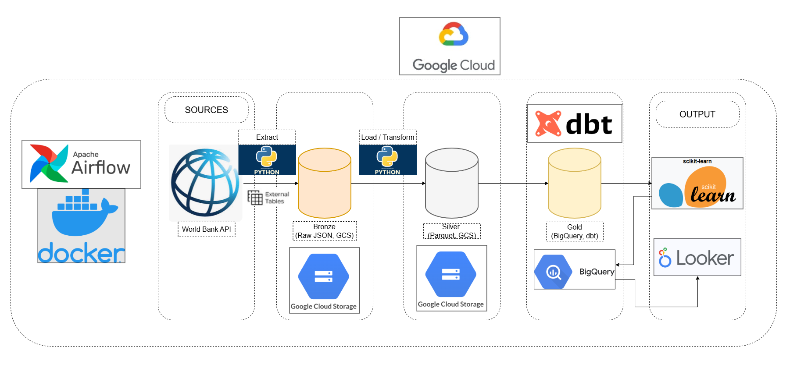
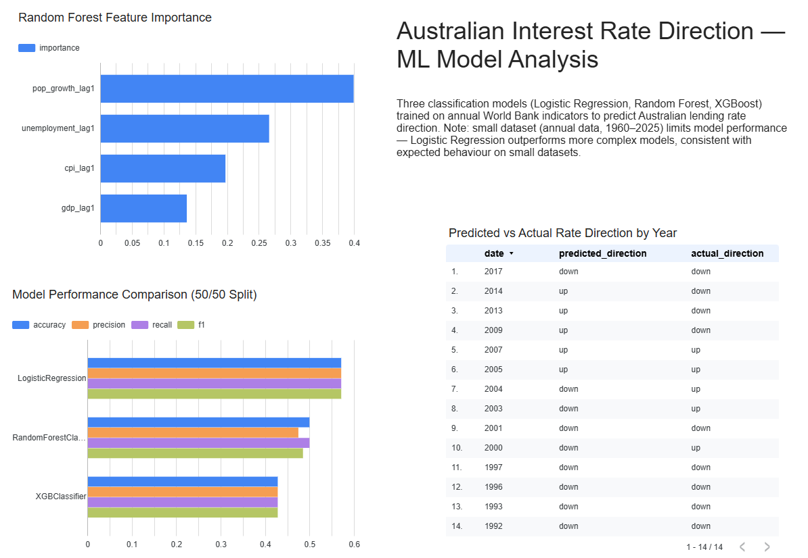
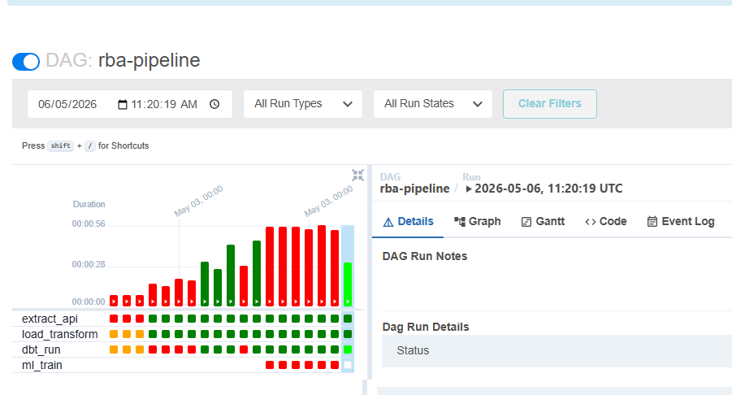

# RBA Interest Rate Pipeline

With inflation surging and petrol prices at record highs, many Australians are asking: will interest rates go up or down? For property investors, this question is critical — higher rates directly reduce borrowing capacity, limiting what you can afford to buy. This pipeline extracts macro-economic indicators from the World Bank API, transforms and models them across a Bronze→Silver→Gold architecture on GCP, and applies machine learning to predict the direction of Australia's interest rates ahead of RBA meetings — helping answer the question: is now a good time to borrow?

## Architecture

```
World Bank API (JSON)
        │
        ▼
  Bronze Layer (GCS)          ← raw JSON, preserved as-is
        │
        ▼
  Silver Layer (GCS)          ← cleaned & flattened Parquet (Python)
        │
        ▼
  Gold Layer (BigQuery)       ← modelled tables (dbt)
        │
        ▼
  ML Layer (BigQuery)         ← rate direction predictions (scikit-learn)
        │
        ▼
  Orchestration (Airflow)     ← scheduled every ~6 weeks (RBA meeting cadence)
```



## Tech Stack

| Layer          | Tool                    |
|----------------|-------------------------|
| Cloud          | GCP                     |
| Object storage | Google Cloud Storage    |
| Warehouse      | BigQuery                |
| Transformation | dbt Core + Python       |
| Orchestration  | Apache Airflow (Docker) |
| ML             | scikit-learn            |
| Language       | Python 3.11+ / SQL      |

## Project Structure

```
rba-pipeline/
├── src/
│   ├── extract/        # API extraction → Bronze (GCS)
│   ├── transform/      # Python transforms → Silver (GCS)
│   └── ml/             # Prediction models
├── dbt/                # dbt models → Gold (BigQuery)
├── airflow/
│   └── dags/           # Orchestration DAGs
├── config/             # Environment config templates
└── tests/              # Unit and integration tests
```

## Setup

### Prerequisites

- Python 3.11+
- GCP project with billing enabled
- GCS buckets: `rba-pipeline-bronze`, `rba-pipeline-silver`
- GCP service account key with Storage Object Admin role

### Install dependencies

```bash
pip install -r requirements.txt
```

### Configure environment

```bash
cp config/.env.example config/.env
# Edit config/.env with your GCP project and bucket names
```

### Authenticate with GCP

```bash
export GOOGLE_APPLICATION_CREDENTIALS=/path/to/service-account-key.json
```

### Run extraction

```bash
python src/extract/rba_extract.py
```

## Dashboard



[View live dashboard](https://datastudio.google.com/reporting/96bc22f1-2266-41d8-a4d5-4362da1fc059)



## ML Results & Limitations

Three classification models were trained to predict the direction of Australia's lending rate (up/down): Logistic Regression, Random Forest, and XGBoost.

**Model performance (50/50 train/test split):**

| Model | Accuracy | Notes |
|---|---|---|
| LogisticRegression | 0.57 | Best performer — simpler model generalises better on small data |
| RandomForestClassifier | 0.50 | Overfits to majority class ("down"), rarely predicts "up" |
| XGBClassifier | 0.43 | Same overfitting behaviour as Random Forest |

**Random Forest feature importance:**

| Feature | Importance | Economic interpretation |
|---|---|---|
| Population growth | 0.39 | New residents drive demand for goods/housing, feeding inflation |
| Unemployment | 0.29 | Low unemployment enables wage growth and higher consumer spending |
| CPI inflation | 0.21 | Lower than expected — annual data may capture the RBA's response rather than the signal |
| GDP growth | 0.18 | Broader economic context for rate decisions |

**Known limitations:**

- **Small dataset** — annual World Bank data yields ~50 usable rows after feature engineering, which is insufficient for complex models like Random Forest and XGBoost to generalise reliably
- **Lag distance** — 1-year lags are too coarse for RBA decision-making; the RBA responds to monthly/quarterly signals (CPI, unemployment) not annual averages
- **Logistic Regression outperforming complex models** is expected behaviour on small datasets — simpler models generalise better when training data is limited

**Future improvements:**

- Integrate ABS (Australian Bureau of Statistics) monthly data for tighter lags and a larger dataset
- Use RBA cash rate decisions directly rather than World Bank lending rate as the target variable

## Updates

### Pub/Sub Extension
The initial pipeline (Modules 1–6) was completed with World Bank annual data as the primary data source. However, as noted in the ML limitations, annual data yields only ~50 usable rows and the   lag is too coarse for RBA decision-making — the RBA responds to monthly signals, not yearly averages.

To address this, the pipeline has been extended with a Google Cloud Pub/Sub streaming module. This lays the groundwork for integrating monthly ABS (Australian Bureau of Statistics) data scraped   directly from the ABS website, which will provide tighter lags and a significantly larger dataset for the ML model.

**What was added:**
- Publisher script: scrapes RBA cash rate decisions, batch loads historical data on first run, then streams new decisions via Pub/Sub as they are published
- Subscriber script: receives messages and inserts rows into BigQuery using the streaming insert API

**Why this matters:**
- Replaces the coarse annual World Bank data with higher-frequency monthly ABS data
- Improves the ML model's ability to detect the signals the RBA actually responds to (monthly CPI, unemployment)
- Demonstrates a production-ready streaming pattern — batch for historical load, streaming for ongoing updates

## Modules

| Module | Description                        | Status      |
|--------|------------------------------------|-------------|
| 1      | Project setup & GCP config         | Complete    |
| 2      | API extraction → Bronze layer      | Complete    |
| 3      | Python transforms → Silver layer   | Complete    |
| 4      | dbt + BigQuery → Gold layer        | Complete    |
| 5      | ML layer (rate direction model)    | Complete    |
| 6      | Airflow DAG orchestration          | Complete    |
| 7      | PySpark module (separate dataset)  | Pending     |

## Data Source

Interest rate data is sourced from the [World Bank Open Data API](https://data.worldbank.org/indicator/FR.INR.LEND), which publishes Australia's lending interest rate (closely tracking RBA cash rate decisions). No API key is required.
