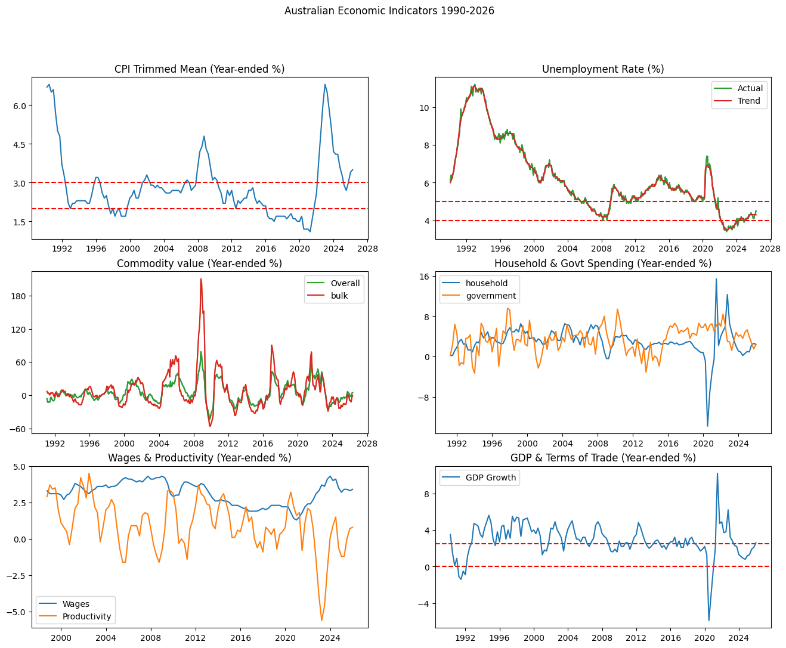

# RBA Interest Rate Pipeline

With inflation surging and petrol prices at record highs, many Australians are asking: will interest rates go up or down? For property investors, this question is critical — higher rates directly reduce borrowing capacity, limiting what you can afford to buy. This pipeline extracts macro-economic indicators from the World Bank API, transforms and models them across a Bronze→Silver→Gold architecture on GCP, and applies machine learning to predict the direction of Australia's interest rates ahead of RBA meetings — helping answer the question: is now a good time to borrow?

## Architecture

```
World Bank API (JSON)
        │
        ▼
  Bronze Layer (GCS)          ← raw JSON, preserved as-is
        │
        ▼
  Silver Layer (GCS)          ← cleaned & flattened Parquet (Python)
        │
        ▼
  Gold Layer (BigQuery)       ← modelled tables (dbt)
        │
        ▼
  ML Layer (BigQuery)         ← rate direction predictions (scikit-learn)
        │
        ▼
  Orchestration (Airflow)     ← scheduled every ~6 weeks (RBA meeting cadence)
```
## Economic Indicators

The pipeline models 6 key macroeconomic indicators used by the RBA in rate decisions:




## Tech Stack

| Layer          | Tool                    |
|----------------|-------------------------|
| Cloud          | GCP                     |
| Object storage | Google Cloud Storage    |
| Warehouse      | BigQuery                |
| Transformation | dbt Core + Python       |
| Streaming      | Google Cloud Pub/Sub    |
| Orchestration  | Apache Airflow (Docker) |
| ML             | scikit-learn            |
| Language       | Python 3.11+ / SQL      |
| Dashboard      | Streamlit / Looker      |

## Project Structure

```
rba-pipeline/  
├── src/
│   ├── extract/                # World Bank API extraction → Bronze (GCS)  
│   ├── transform/              # Python transforms → Silver (GCS)
│   ├── ml/                     # Original ML model (World Bank data)
│   └── project_extension/
│       ├── extract/            # RBA tables extraction → Bronze (GCS)
│       ├── transform/          # RBA tables transforms → Silver (GCS)
│       ├── ml/                 # Extended ML model (RBA meeting data)
│       ├── pubsub/             # Pub/Sub streaming module
│       └── rba_tables/         # EDA notebook
├── dbt/                        # dbt models → Gold (BigQuery)
├── airflow/
│   └── dags/                   # Orchestration DAGs
├── streamlit/                  # Streamlit dashboard
├── .streamlit/                 # Streamlit config and theme
├── config/                     # Environment config templates
└── tests/                      # Unit and integration tests
```

## Setup

### Prerequisites

- Python 3.11+
- GCP project with billing enabled
- GCS buckets: `rba-pipeline-bronze`, `rba-pipeline-silver`
- GCP service account key with Storage Object Admin role

### Install dependencies

```bash
pip install -r requirements.txt
```

### Configure environment

```bash
cp config/.env.example config/.env
# Edit config/.env with your GCP project and bucket names
```

### Authenticate with GCP

Store your service account key at `config/service-account-key.json` (already gitignored), then set the environment variable:

**Linux/macOS:**
```bash
export GOOGLE_APPLICATION_CREDENTIALS=config/service-account-key.json
```

**Windows (PowerShell):**
```powershell
$env:GOOGLE_APPLICATION_CREDENTIALS = "config/service-account-key.json"
```

### Run extraction

```bash
python src/extract/rba_extract.py
```

## Dashboard


**Streamlit Dashboard (live):** [RBA Rate Decision Tracker](https://rba-pipeline-escjopb6x4dkn2epqvgvzz.streamlit.app/)  — Next meeting prediction, current economic conditions, model performance and EDA charts

**Looker Studio Dashboard:** [View report](https://datastudio.google.com/reporting/96bc22f1-2266-41d8-a4d5-4362da1fc059)
— Model performance comparison, feature importance, predicted vs actual by year


## ML Results & Limitations

Three classification models were trained to predict the direction of Australia's cash rate (raise/hold/cut) using RBA meeting data with macroeconomic
indicators including trimmed mean CPI, unemployment, GDP growth, commodity prices, government spending and productivity.

**Model performance (80/20 train/test split, SMOTE for class imbalance):**

| Model | Accuracy | Notes |
|---|---|---|
| RandomForestClassifier | 0.75 | Strong performer on extended dataset |
| XGBClassifier | 0.75 | Matches Random Forest performance |
| LogisticRegression | 0.40 | Underperforms on higher-frequency data |

**Feature importance (Random Forest):**

| Feature | Importance | Economic interpretation |
|---|---|---|
| Commodity price ratio | 0.20 | Bulk vs overall commodity prices — key export indicator |
| Trimmed mean CPI | 0.19 | RBA's preferred inflation measure |
| GDP growth | 0.18 | Broader economic growth context |
| Unemployment | 0.16 | Labour market tightness drives wage and inflation pressure |
| Government spending | 0.14 | Fiscal stimulus can be inflationary |
| Productivity growth | 0.14 | Higher productivity reduces cost-push inflation |

**Known limitations:**

- **Class imbalance** — "hold" decisions dominate the dataset (224 hold vs 40 raise vs 34 cut); SMOTE applied to balance training data
- **Multicollinearity** — household consumption strongly correlated to GDP; commodity prices negatively correlated to unemployment
- **Annual publication lag** — some indicators (e.g. productivity) published annually, introducing lag vs RBA's real-time data


## Updates

### Pub/Sub Extension
The initial pipeline (Modules 1–6) was completed with World Bank annual data as the primary data source. However, as noted in the ML limitations, annual data
yields only ~50 usable rows and the lag is too coarse for RBA decision-making — the RBA responds to monthly signals, not yearly averages.

**What was added:**
- Publisher script: scrapes RBA cash rate decisions, batch loads historical data on first run, then streams new decisions via Pub/Sub as they are published
- Subscriber script: receives messages and inserts rows into BigQuery using the streaming insert API

**Why this matters:**
- Demonstrates a production-ready streaming pattern — batch for historical load, streaming for ongoing updates
- Lays the groundwork for real-time updates as new rate decisions are announced

### RBA Tables Extension & Streamlit Dashboard

To address the ML limitations of the World Bank dataset, the pipeline was extended with higher-frequency data sourced directly from the RBA's published
statistical tables.

**What was added:**
- Extraction of 6 RBA statistical tables (CPI, labour force, commodity prices, GDP, government expenditure, productivity) → Bronze layer
- Python transforms → Silver layer (Parquet)
- 8 new dbt staging models and an intermediate model joining all features to RBA decision dates → Gold layer
- Extended ML model trained on ~300 rows of RBA meeting data with SMOTE for class imbalance — Random Forest and XGBoost both achieving 75% accuracy
- Google Cloud Pub/Sub streaming module for real-time rate decision updates → BigQuery
- Streamlit dashboard deployed to Streamlit Community Cloud — showing next meeting prediction, current economic conditions, model performance and EDA charts

**Why this matters:**
- Higher-frequency data (monthly/quarterly vs annual) better reflects the signals the RBA actually responds to
- ~300 usable rows vs ~50 significantly improves model reliability
- Live dashboard makes findings accessible to a non-technical audience

## Modules

| Module | Description                        | Status      |
|--------|------------------------------------|-------------|
| 1      | Project setup & GCP config         | Complete    |
| 2      | API extraction → Bronze layer      | Complete    |
| 3      | Python transforms → Silver layer   | Complete    |
| 4      | dbt + BigQuery → Gold layer        | Complete    |
| 5      | ML layer (rate direction model)    | Complete    |
| 6      | Airflow DAG orchestration          | Complete    |
| 7      | PySpark module (separate dataset)  | Pending     |

## Data Source

Interest rate data is sourced from the [World Bank Open Data API](https://data.worldbank.org/indicator/FR.INR.LEND), which publishes Australia's lending interest rate (closely tracking RBA cash rate decisions). No API key is required.

RBA statistical tables are sourced directly from the [Reserve Bank of Australia](https://www.rba.gov.au/statistics/) website, covering CPI, labour force, commodity prices, GDP, government expenditure and productivity. No API key is required.
