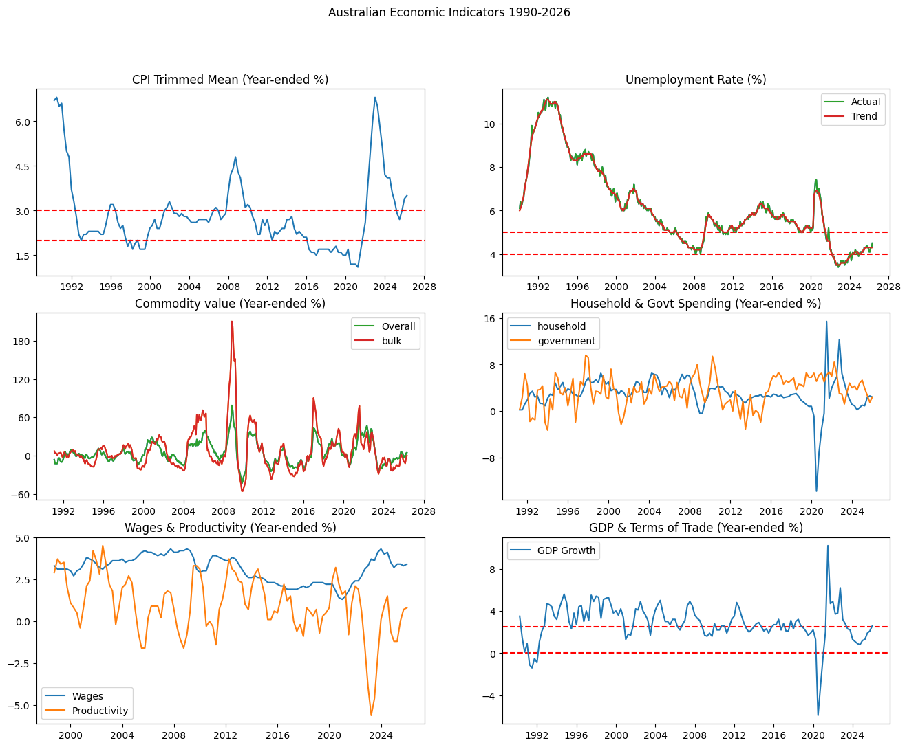
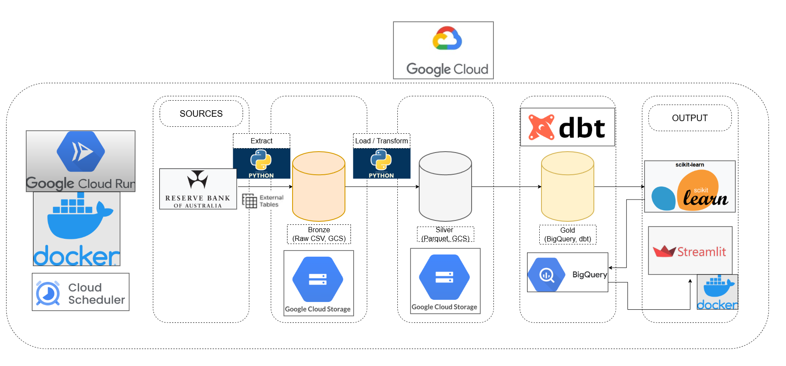
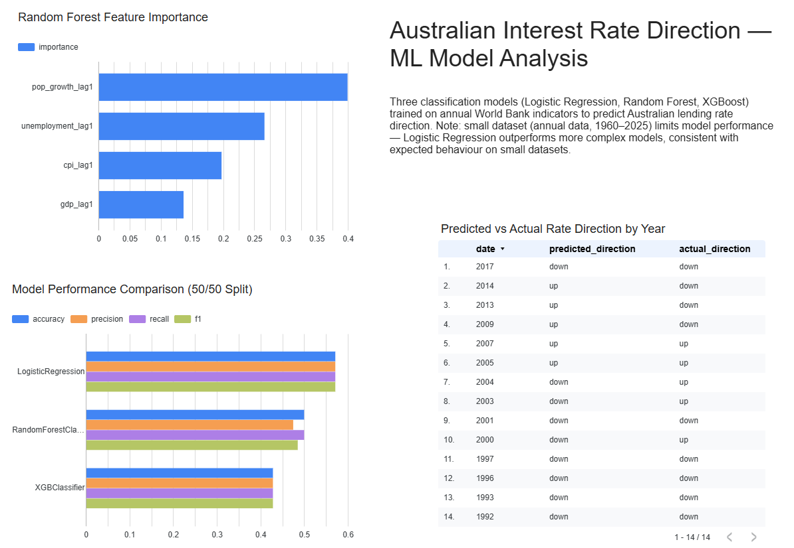
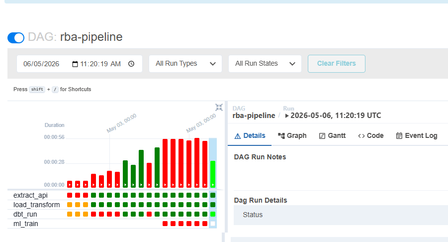
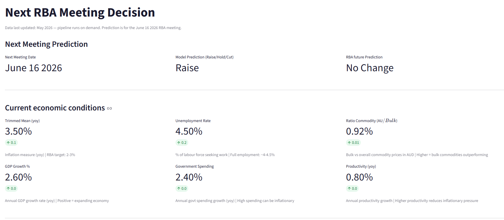

# RBA Interest Rate Pipeline

[](https://github.com/Daven88/rba-pipeline/actions/workflows/deploy.yml)

With inflation surging and petrol prices at record highs, many Australians are asking: will interest rates go up or down? For property investors, this question is critical — higher rates directly reduce borrowing capacity, limiting what you can afford to buy. This pipeline extracts macro-economic indicators from the Reserve Bank of Australia's published statistical tables, transforms and models them across a Bronze→Silver→Gold architecture on GCP, and applies machine learning to predict the direction of Australia's interest rates ahead of RBA meetings — helping answer the question: is now a good time to borrow?

## Architecture

```
RBA statistical tables (CSV)
        │
        ▼
  Bronze Layer (GCS)          ← raw CSV, preserved as-is
        │
        ▼
  Silver Layer (GCS)          ← cleaned & flattened Parquet (Python)
        │
        ▼
  Gold Layer (BigQuery)       ← modelled tables (dbt) + 57 data tests
        │
        ▼
  ML Layer (BigQuery)         ← rate direction predictions (scikit-learn)
        │
        ▼
  Cloud Run Job               ← daily trigger, gated on the RBA meeting calendar
  + Cloud Scheduler              so it runs only on T-2 and T+14 of each meeting
```
## Economic Indicators

The pipeline models 6 key macroeconomic indicators used by the RBA in rate decisions:






## Tech Stack

| Layer          | Tool                    |
|----------------|-------------------------|
| Cloud          | GCP                     |
| Object storage | Google Cloud Storage    |
| Warehouse      | BigQuery                |
| Transformation | dbt Core + Python       |
| Testing        | 57 dbt data tests + 19 pytest |
| Streaming      | Google Cloud Pub/Sub    |
| Orchestration  | Cloud Run Jobs + Cloud Scheduler |
| CI/CD          | GitHub Actions + Workload Identity Federation |
| ML             | scikit-learn            |
| Language       | Python 3.12 / SQL       |
| Dashboard      | Streamlit on Cloud Run  |

## Project Structure

```
rba-pipeline/  
├── main.py                     # Cloud Run Job entrypoint + meeting-calendar gate
├── Dockerfile                  # Pipeline container image
├── src/
│   └── project_extension/
│       ├── extract/            # RBA tables extraction → Bronze (GCS)
│       ├── transform/          # RBA tables transforms → Silver (GCS)
│       ├── ml/                 # ML model (RBA meeting data)
│       ├── pubsub/             # Pub/Sub streaming module
│       └── rba_tables/         # EDA notebook
├── dbt/rba_pipeline/
│   ├── models/                 # staging → intermediate → marts (Gold)
│   ├── macros/                 # custom generic tests (not_empty)
│   └── seeds/                  # RBA meeting calendar (2026–2027)
├── streamlit/                  # Streamlit dashboard (own Docker context)
├── docs/                       # Architecture diagram, design notes
├── config/                     # Environment config templates
└── tests/                      # Unit and integration tests
```

## Setup

### Prerequisites

- Python 3.12
- GCP project with billing enabled
- GCS buckets: `rba-pipeline-bronze`, `rba-pipeline-silver`
- BigQuery dataset `gold`

### Install dependencies

```bash
pip install -r requirements.txt
```

### Configure environment

```bash
cp config/.env.example config/.env
# Edit config/.env with your GCP project and bucket names
```

### Authenticate with GCP

The pipeline uses Application Default Credentials — there are **no service account keys
anywhere in this project**. Locally:

```bash
gcloud auth application-default login
```

In production, the Cloud Run Job and the dashboard each run as their own service account
with no key material involved. The dashboard's account is deliberately read-only
(`bigquery.dataViewer`, `bigquery.jobUser`) so a bug in the public app can never mutate
the warehouse.

### Run the pipeline locally

```bash
python main.py                    # honours the meeting-calendar gate
FORCE_RUN=true python main.py     # bypasses the gate
```

### Run dbt

```bash
cd dbt/rba_pipeline
dbt deps
dbt build                         # 11 models, 1 seed, 57 data tests
```

## Dashboard



**Streamlit Dashboard (live):** [RBA Rate Decision Tracker](https://rba-dashboard-213888644789.australia-southeast1.run.app) — Next meeting prediction, current economic conditions, model performance, an AI-generated market commentary and a natural-language Q&A over RBA board minutes

**Looker Studio Dashboard:** [View report](https://datastudio.google.com/reporting/96bc22f1-2266-41d8-a4d5-4362da1fc059)
— Model performance comparison, feature importance, predicted vs actual by year


## Architecture Decisions

### Orchestration: Airflow → Cloud Run Jobs

The pipeline was originally orchestrated by a 4-task Airflow DAG running in Docker
(LocalExecutor, with `src/`, `dbt/` and GCP credentials volume-mounted). It worked, but
Airflow was the wrong tool for this workload.



The RBA meets **eight times a year**. Cloud Composer — managed Airflow on GCP — runs a
permanently-on GKE cluster at roughly **$300/month**, which works out at about $450 per
pipeline run. Self-hosting Airflow means running and patching a scheduler that is idle
99% of the time.

It now runs as a **Cloud Run Job** triggered daily by **Cloud Scheduler**, with the
meeting calendar as a gate inside the container:

- Cron cannot express "two days before an irregular date", so the job wakes daily,
  reads `gold.rba_meeting_dates`, and exits 0 unless today is **T-2** or **T+14** of a
  meeting
- **T-2** catches every data release the Board will see — the RBA schedules meetings
  after the ABS releases it wants
- **T+14** captures the actual decision once minutes are published, so the training set
  gains the meeting it just predicted

**Trade-off:** no Airflow UI, no task-level retries, no backfill semantics. At four
sequential tasks with no branching, none of those were being used. Cost went from ~$300
a month to cents per run.

### CI/CD

Every push to `master` runs the pytest suite, and the build is gated on it
(`needs: test`). Only if the tests pass does the workflow build the image, push it
to Artifact Registry and deploy the Cloud Run Job.

Authentication uses **Workload Identity Federation** — GitHub mints a short-lived
OIDC token that GCP exchanges for credentials, scoped by attribute condition to this
repository alone. No service account key exists to leak.

The last step matters more than it looks: a `jobs deploy` reports success without ever
starting the container, so it proves almost nothing. The workflow therefore executes
the job **without** `FORCE_RUN`, which boots the real entrypoint, reads the meeting
calendar from BigQuery and exits 0 because today is not a run day. A broken image
fails the build instead of failing silently six weeks later.

`should_run_today()` is split into a pure `run_days_from(meetings)` and a fetcher
precisely so the T-2/T+14 arithmetic can be asserted in milliseconds rather than
discovered by a missed meeting.

### Infrastructure as code

Everything in GCP is described in `terraform/` - the buckets, the `gold` dataset, three
service accounts and their IAM, the workload identity pool and provider, Artifact
Registry, the Cloud Run job, the dashboard service and Cloud Scheduler.

It was built by hand with `gcloud` over several months, then **imported** rather than
recreated: 22 resources adopted into state with zero downtime and nothing destroyed.
`terraform plan` now reports no changes.

Two details worth calling out:

**Container images are excluded via `ignore_changes`.** Terraform owns the shape of the
job - memory, timeout, identity, environment. GitHub Actions owns which image runs.
Without that exclusion every `terraform apply` would roll the job back to a placeholder
tag and silently undo the last deploy.

**The first plan wanted to delete four things the config had not mentioned** - the
scheduler's description, `deletion_protection` on the dashboard, `cpu_idle`, and
`session_affinity`, which Streamlit needs to keep websocket state on one instance.
Terraform removes whatever you do not describe, so the first plan after an import is
where you find out what you were about to destroy.

State lives in a versioned GCS bucket that is deliberately not managed by this
configuration, since Terraform cannot create the bucket that holds its own state.

### No service account keys

Google org policy blocked service-account key creation on the original project, which
turned out to be a good constraint. Everything runs on Application Default Credentials
locally and attached service accounts in production. The dashboard even calls a private
Cloud Run service in a *different* GCP project by minting an ID token at request time —
no key material anywhere in the system.

### Silver overwrites rather than snapshots

Early runs wrote a dated Parquet per table per run, each holding the full history, with
external tables globbing the folder. After five runs `ext_cpi` held 865 rows across 173
distinct dates. The marts were only correct by accident, via a `ROW_NUMBER() ... rn = 1`
pattern written for an unrelated reason. Silver now overwrites one file per table.

That change made `not_empty` tests essential rather than optional: with no dated
snapshots to fall back on, a half-failed extract writing an empty Parquet would destroy
the good data — and every `not_null` and `unique` test would still pass, because they
pass vacuously on an empty table.

### Sentiment is modelled but deliberately not a feature

`mart_rba_decisions_with_sentiment` joins LLM-derived tone (hawkish / neutral / dovish),
a confidence score and a dominant concern from a separate retrieval pipeline over RBA
board minutes. It is built and tested, but it does **not** feed the model.

The reason is timing. The minutes are published roughly two weeks after the meeting —
which is why this pipeline has a T+14 run at all. So at prediction time for a given
meeting, that meeting's sentiment does not yet exist. Joining it to its own decision
would train the model on a description of the answer, the same class of bug as the
random train/test split fixed earlier in this project's history: a large apparent
accuracy gain that means nothing.

The version that would be legitimate is *lagged* sentiment — does the previous
meeting's tone predict the next move. That was measured against the cost and left
unbuilt: sentiment only covers 210 of 299 meetings (it starts in 2006, the mart starts
in 1998), so `dropna()` would cut the training set by 30% while adding roughly six
one-hot columns. Fewer rows and more dimensions, on a dataset with only 34 cuts and 40
raises, is the wrong trade in every direction.

The table stays because it is cheap and the join is already correct. If the minutes
corpus is ever backfilled to 1998, the experiment becomes worth running.

## Data Quality

`dbt build` runs **57 data tests** across every layer — sources, staging, intermediate
and marts:

| Test | Applied to | Catches |
|---|---|---|
| `not_null` | source and staging date/value columns | Missing data at the boundary |
| `unique` | every staging and mart date column | Duplicate history from re-runs |
| `not_empty` (custom) | every mart and the intermediate model | A model silently returning zero rows |
| `accepted_values` | LLM-derived sentiment and dominant concern | Prompt drift producing new labels |
| `accepted_range` | 8 numeric columns | Column shifts — a positional `usecols` grabbing an index level where a percentage belongs |
| `relationships` | mart date → staging decisions | Mart rows with no decision behind them |
| `unique_combination_of_columns` | long-format indicator table | Grain violations where a plain `unique` would be wrong |

Range bounds are set at *economically impossible* rather than *historically
unprecedented* — unemployment `0–20`, not `3–12`. A test that fires during a genuine
recession gets disabled, and then it protects nothing.

## ML Results & Limitations

Four classification models were trained to predict the direction of Australia's cash rate (raise/hold/cut) using RBA meeting data with macroeconomic
indicators including trimmed mean CPI, unemployment, GDP growth, commodity prices, government spending and productivity.

**Model performance (chronological 80/20 train/test split, SMOTE for class imbalance):**

Training and test sets are split by meeting date — the earliest 80% of meetings train the model, the most recent 20% test it — so the model is never
evaluated on data that occurred before what it was trained on. An earlier version of this pipeline used a random split, which let future meetings leak
into training and inflated accuracy to ~0.75; the numbers below reflect the corrected, forecast-realistic split.

| Model | Accuracy | Macro F1 | Notes |
|---|---|---|---|
| SVC | 0.50 | **0.41** | Best model by macro F1 — most balanced across all three classes |
| LogisticRegression | 0.42 | 0.40 | Lower accuracy but second-best at catching minority classes |
| XGBClassifier | 0.53 | 0.37 | |
| RandomForestClassifier | 0.55 | 0.33 | Highest accuracy but near-zero recall on "cut"/"raise" |

**Model selection uses macro F1, not accuracy** — with "hold" decisions making up ~67% of meetings, a model that always predicts "hold" scores 0.67
accuracy while never once identifying a rate change. Macro F1 weights all three classes equally, so it penalizes that failure mode instead of rewarding it.

**Feature importance (Random Forest):**

| Feature | Importance | Economic interpretation |
|---|---|---|
| Commodity price ratio | 0.22 | Bulk vs overall commodity prices — key export indicator |
| Trimmed mean CPI | 0.22 | RBA's preferred inflation measure |
| Productivity growth | 0.16 | Higher productivity reduces cost-push inflation |
| Government spending | 0.15 | Fiscal stimulus can be inflationary |
| Unemployment | 0.13 | Labour market tightness drives wage and inflation pressure |
| GDP growth | 0.12 | Broader economic growth context |

**Known limitations:**

- **Class imbalance** — "hold" decisions dominate the dataset (224 hold vs 40 raise vs 34 cut); SMOTE applied to balance training data, macro F1 used for model selection to avoid rewarding majority-class bias
- **Small test set** — 60 held-out meetings, only 4 of which are "raise" events, limits how confidently minority-class performance can be judged
- **Multicollinearity** — household consumption strongly correlated to GDP; commodity prices negatively correlated to unemployment
- **Annual publication lag** — some indicators (e.g. productivity) published annually, introducing lag vs RBA's real-time data


## Updates

### ML Evaluation Fixes (Data Leakage & Metric Selection)

A review of `src/project_extension/ml/train.py` found the train/test split was randomly shuffling meetings before splitting — discarding the chronological
ordering the data was loaded in and letting the model train on meetings that occurred *after* the ones it was tested on. This is a classic time-series
leakage bug, and it was inflating accuracy to a figure (~0.75) that didn't reflect real forecasting performance.

**What was fixed:**
- Random `train_test_split` replaced with a chronological cutoff — earliest 80% of meetings train, most recent 20% test
- `random_state` fixed on RandomForest, XGBoost and SMOTE so results are reproducible run-to-run (previously only the now-removed random split was seeded, so RF/XGB/SMOTE varied between runs)
- Best-model selection switched from raw accuracy to macro F1, since accuracy rewarded a model for defaulting to the majority "hold" class
- Added `SVC` (Support Vector Machine) to the model comparison — it's now the top performer by macro F1, better suited to this dataset's small sample size than the other models tested

**Why this matters:**
- The corrected numbers (0.41–0.50 accuracy, 0.33–0.41 macro F1) are lower than the original 0.75, but they're the real, trustworthy figures — an evaluation methodology that leaks the future into training will always look better than it is
- Verified against baselines: a naive "always predict hold" classifier scores 0.67 accuracy but 0.27 macro F1, and a stratified-random guesser scores 0.34 macro F1 — the current best model (0.41) genuinely beats both, just modestly, which is a realistic ceiling given ~300 rows and rare rate-change events

**In progress:** investigating whether RBA statement sentiment (from a separate `rba-rag` retrieval pipeline) can be joined in as an additional feature. Initial checks found the sentiment table's date field is the meeting date while `mart_rba_decisions.date` is the announcement date (a consistent one-day offset, not a simple date match), plus at least one row that doesn't correspond to any meeting at all — worth resolving in that pipeline before merging the data in here.

### Pub/Sub Extension
The initial pipeline (Modules 1–6) was completed with World Bank annual data as the primary data source. However, as noted in the ML limitations, annual data
yields only ~50 usable rows and the lag is too coarse for RBA decision-making — the RBA responds to monthly signals, not yearly averages.

**What was added:**
- Publisher script: scrapes RBA cash rate decisions, batch loads historical data on first run, then streams new decisions via Pub/Sub as they are published
- Subscriber script: receives messages and inserts rows into BigQuery using the streaming insert API

**Why this matters:**
- Demonstrates a production-ready streaming pattern — batch for historical load, streaming for ongoing updates
- Lays the groundwork for real-time updates as new rate decisions are announced

### RBA Tables Extension & Streamlit Dashboard

To address the ML limitations of the World Bank dataset, the pipeline was extended with higher-frequency data sourced directly from the RBA's published
statistical tables.

**What was added:**
- Extraction of 6 RBA statistical tables (CPI, labour force, commodity prices, GDP, government expenditure, productivity) → Bronze layer
- Python transforms → Silver layer (Parquet)
- 8 new dbt staging models and an intermediate model joining all features to RBA decision dates → Gold layer
- Extended ML model trained on ~300 rows of RBA meeting data with SMOTE for class imbalance (the 75% accuracy originally reported here was an artefact of train/test leakage — see ML Evaluation Fixes below)
- Google Cloud Pub/Sub streaming module for real-time rate decision updates → BigQuery
- Streamlit dashboard containerised and deployed to Cloud Run with keyless service-account auth — showing next meeting prediction, current economic conditions, model performance and EDA charts

**Why this matters:**
- Higher-frequency data (monthly/quarterly vs annual) better reflects the signals the RBA actually responds to
- ~300 usable rows vs ~50 significantly improves model reliability
- Live dashboard makes findings accessible to a non-technical audience



## Documentation

The dbt catalogue is published at
**[daven88.github.io/rba-pipeline/dbt](https://daven88.github.io/rba-pipeline/dbt/)** -
every model and column description, column types read live from BigQuery, the tests
attached to each column, compiled SQL, and an interactive lineage graph. Regenerate with
`dbt docs generate` and copy `target/index.html`, `manifest.json` and `catalog.json` into
`docs/dbt/`.

### Known limitation: everything lands in one dataset

The lineage graph shows sources in `gold` feeding staging models that feed marts back in
`gold`, which reads as though the layers run backwards. They do not - the arrows are
correct. The problem is the labels: raw external tables, staging views, the intermediate
model, the marts, the ML outputs and the seed all live in a single BigQuery dataset
called `gold`.

So the medallion layers exist in the folder structure and in `dbt_project.yml`, but not
in the warehouse. The fix is per-folder `+schema:` config splitting them into `raw`,
`staging` and `gold`, which also means recreating the external tables in the new dataset
and adding those datasets to Terraform. Deliberately deferred: it is a naming problem
rather than a correctness one, every test passes either way, and it is not worth the
breakage risk immediately before a scheduled unattended run.

## Modules

| Module | Description                        | Status      |
|--------|------------------------------------|-------------|
| 1      | Project setup & GCP config         | Complete    |
| 2      | Source extraction → Bronze layer   | Complete    |
| 3      | Python transforms → Silver layer   | Complete    |
| 4      | dbt + BigQuery → Gold layer        | Complete    |
| 5      | ML layer (rate direction model)    | Complete    |
| 6      | Orchestration (Airflow → Cloud Run Jobs) | Complete |
| 7      | PySpark module (separate dataset)  | Pending     |

## Data Source

RBA statistical tables are sourced directly from the [Reserve Bank of Australia](https://www.rba.gov.au/statistics/) website, covering CPI, labour force, commodity prices, GDP, government expenditure and productivity. No API key is required.

Cash rate decisions are scraped from the RBA and loaded via Pub/Sub. The meeting
calendar is maintained as a dbt seed from the RBA's published
[Board meeting schedule](https://www.rba.gov.au/schedules-events/board-meeting-schedules.html).

An earlier version of this pipeline used the [World Bank Open Data API](https://data.worldbank.org/indicator/FR.INR.LEND)
as its primary source. It was retired once the RBA tables were in place: World Bank data
is annual, yielding only ~50 usable rows against ~300 from RBA meeting data, and the
`FR.INR.LEND` indicator has published nothing since 2019.
